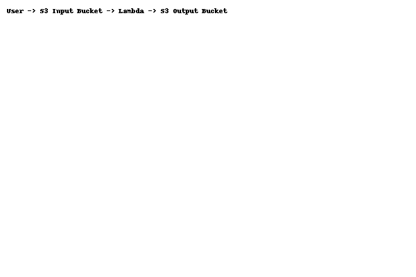

# Automated Image Processing System Using AWS Lambda and S3

## 📌 Overview
This project automatically processes images uploaded to an AWS S3 bucket using AWS Lambda. It resizes the image and stores it in another bucket.

## 🛠️ Technologies Used
- AWS Lambda
- AWS S3
- AWS IAM
- Python 3.9
- Boto3
- Pillow

## 🏗️ Architecture

## 📂 Folder Structure
- `lambda/` - Lambda function code.
- `screenshots/` - Setup screenshots.
- `deployment-guide.md` - Step-by-step setup guide.

## 🚀 How to Deploy
See [`deployment-guide.md`](deployment-guide.md).

## 📜 License
MIT License
